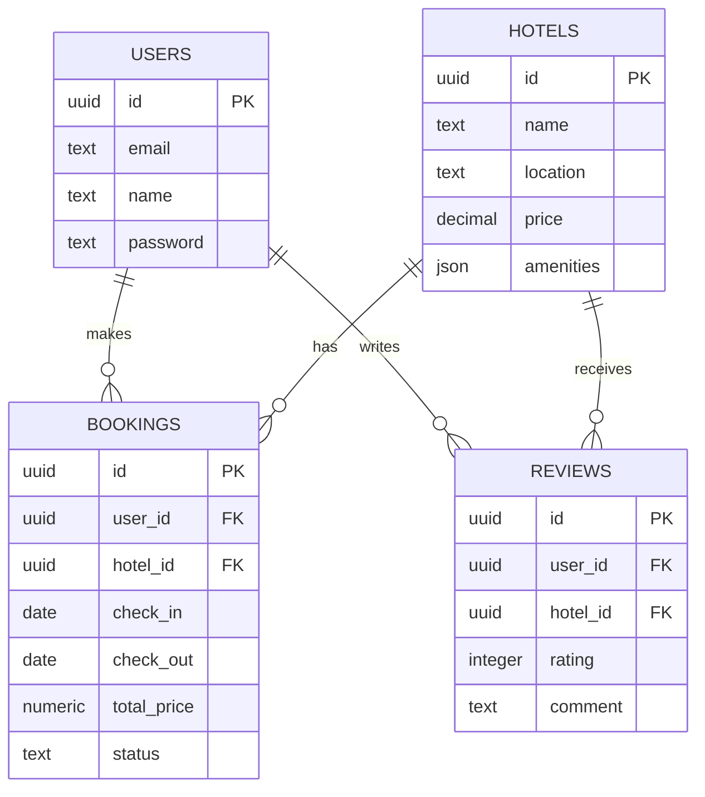
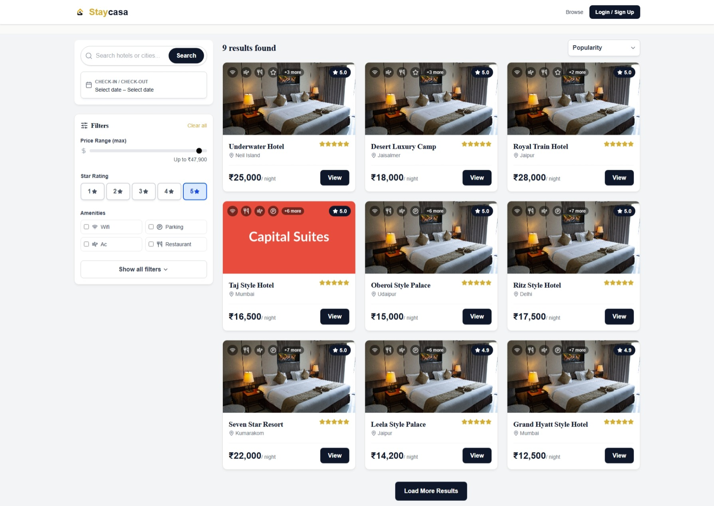
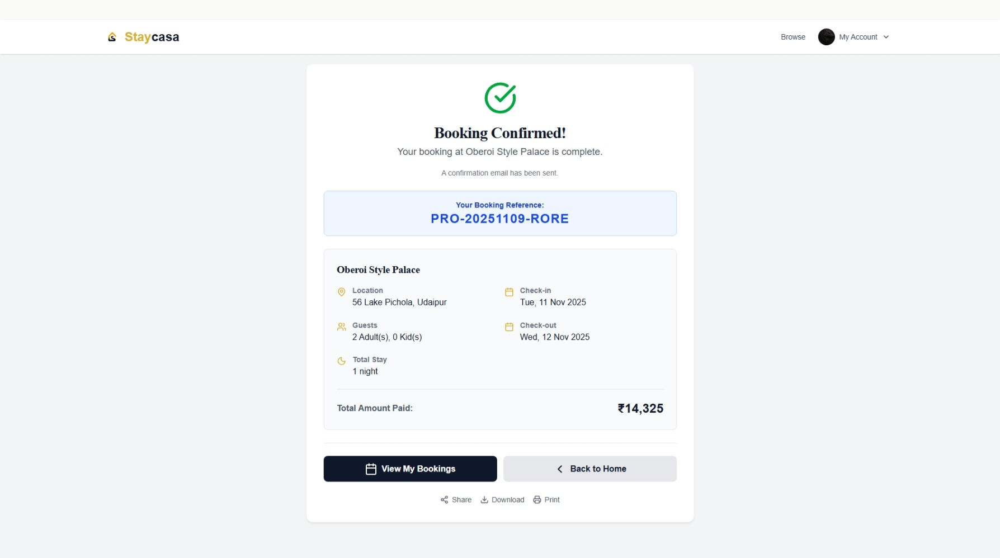
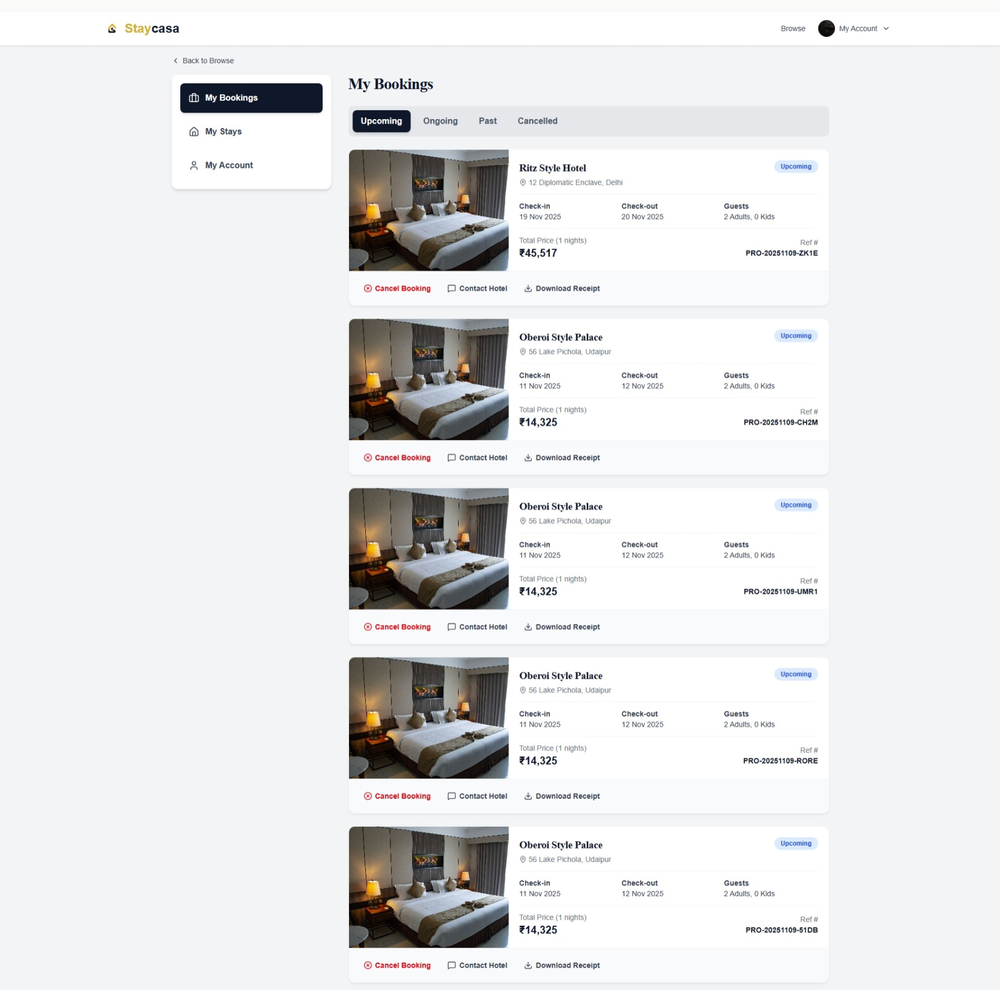
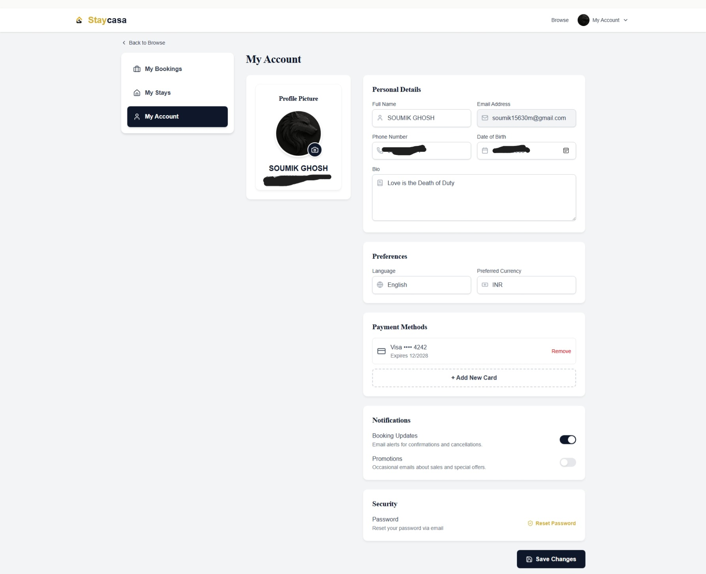
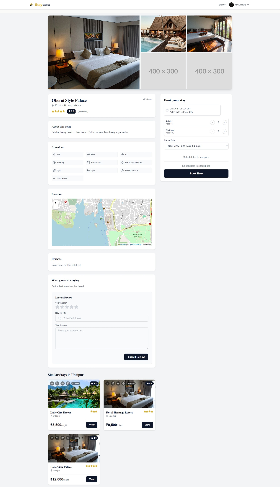

<!-- PROJECT LOGO -->
<p align="center">
  
</p>

<h1 align="center">StayCasa — Modern Full-Stack Hotel Booking Platform</h1>

<p align="center">
  <b>A refined, full-stack hotel booking platform built with React, TypeScript, and Supabase — engineered for scalability, reliability, and a premium user experience.</b>
  <br/><br/>
  <a href="https://www.houseofstk.com" target="_blank">
    
  </a>
  <br/><br/>
  <a href="https://github.com/Soumik15630/staycasa-hotel-booking-platform"><strong>Explore the code »</strong></a>
  <br/><br/>
  <!-- Tech Stack Badges -->
  <a href="https://react.dev">
    
  </a>
  <a href="https://supabase.com">
    
  </a>
  <a href="https://www.typescriptlang.org">
    
  </a>
  <a href="https://tailwindcss.com">
    
  </a>
  <a href="https://www.postgresql.org">
    
  </a>
  <a href="https://tanstack.com/query/latest">
    
  </a>
  <br/>
  <a href="https://supabase.com/auth">
    
  </a>
  <a href="https://resend.com">
    
  </a>
  <a href="https://github.com/parallax/jsPDF">
    
  </a>
  <a href="https://react-leaflet.js.org">
    
  </a>
</p>

---

## Why StayCasa

StayCasa isn’t a template — it’s a production-ready, **luxury SaaS blueprint** for a hotel booking ecosystem.

**Key Advantages:**
- **Enterprise-grade architecture:** Supabase Edge Functions + React 18 + PostgreSQL
- **Scalable design:** Modular React structure with reusable UI components
- **Real-world flow:** From browsing → booking → PDF receipt → dashboard management
- **Modern stack:** TypeScript, Tailwind, and real-time Supabase integration
- **Premium experience:** Every transition, shadow, and layout follows modern SaaS UX standards  

> Built to showcase full-stack mastery — not just function, but form.

---

## Overview

**StayCasa** is a next-generation hotel booking platform that merges clean design with powerful backend automation.  
It enables dynamic hotel listings, secure Supabase authentication, automated transactional emails, and PDF-based receipts — built for performance and beauty.

---

## Tech Stack Overview

| Layer | Technology | Description |
|-------|-------------|--------------|
| Frontend | [React 18](https://react.dev) + [TypeScript](https://www.typescriptlang.org) | Modular, type-safe user interface |
| Styling | [Tailwind CSS](https://tailwindcss.com) + [Framer Motion](https://www.framer.com/motion) | Scalable design system with subtle motion |
| Backend | [Supabase](https://supabase.com) (Auth + PostgreSQL + Edge Functions) | Secure, serverless backend |
| State | [React Query](https://tanstack.com/query/latest) | Cached async state management |
| Validation | [Zod](https://github.com/colinhacks/zod) + [React Hook Form](https://react-hook-form.com) | Schema-based validation |
| Email API | [Resend](https://resend.com) | Automated confirmation and cancellation emails |
| PDF Engine | [jsPDF](https://github.com/parallax/jsPDF) | On-demand client-side receipts |
| Map Engine | [React Leaflet](https://react-leaflet.js.org) | Interactive hotel map integration |
| Utility | [date-fns](https://date-fns.org) | Date/time logic and formatting |

---

## Architecture Snapshot

```bash
staycasa/
├── src/
│   ├── components/        # Reusable UI (HotelCard, AuthForm, FilterBar)
│   ├── pages/             # Page-level routes
│   ├── layouts/           # Dashboard shells, shared structures
│   ├── lib/               # Supabase client, schemas, utilities
│   ├── data/              # TypeScript types and constants
│   └── main.tsx           # Application entry point
└── supabase/
    ├── functions/         # Edge Functions for email notifications
    └── config.toml        # Supabase project configuration
````

---

## Database Schema Diagram

A simplified ERD representing Supabase tables:



---

## Authentication Flows

StayCasa’s authentication system integrates Supabase and Framer Motion for a fluid, modern login experience.

| Flow             | Steps                        | Description                  |
| ---------------- | ---------------------------- | ---------------------------- |
| Password Sign-In | Email + Password             | Standard validation flow     |
| Passwordless OTP | Email → OTP Verify           | Secure, magic-link login     |
| Sign-Up          | Email → OTP → Password       | Two-step secure registration |
| Password Reset   | Logged-in & Logged-out modes | Context-aware recovery       |

---

## Core Features

### Hotel Discovery

* Infinite scrolling via React Query
* Debounced search input for performance
* Supabase RPC-driven filtering
* Real-time price updates

### Booking Flow

* Pending → Confirmed transaction state
* Mock payment simulation logic
* Resend API confirmation emails

### Dashboard

* Three-tab layout: Profile / Bookings / Reviews
* Avatar upload via Supabase Storage
* Refund logic using 48-hour cutoff
* Review upsert functionality

### Utilities

* `downloadBookingPDF()` — instant PDF invoice
* `calculatePrice()` — modular rate computation
* `check_room_availability()` — RPC-based real-time availability

---

## Local Setup

### Prerequisites

* Node.js **v18+**
* npm or yarn
* Supabase CLI (for local database and edge functions)

  ```bash
  npm install -g supabase
  ```

### Setup Instructions

```bash
# Clone the repo
git clone https://github.com/Soumik15630/staycasa-hotel-booking-platform.git
cd staycasa-hotel-booking-platform

# Install dependencies
npm install

# Start Supabase locally
supabase start

# Run development server
npm run dev
```

### Environment Variables

Create a `.env` file or copy from `.env.example`:

```bash
VITE_SUPABASE_URL=https://your-project.supabase.co
VITE_SUPABASE_ANON_KEY=your-public-anon-key
VITE_RESEND_API_KEY=your-resend-api-key
```

---

## Preview

### Browse Hotels



### Booking Confirmation



### My Bookings Dashboard



### My Account



### Hotel Details



---

## Roadmap

* [ ] Stripe / Razorpay live payments
* [ ] AI-powered price forecasting
* [ ] Push notifications
* [ ] Multi-language localization
* [ ] PWA optimization

---

## Testing

| Type        | Framework             | Focus                              |
| ----------- | --------------------- | ---------------------------------- |
| Unit        | Jest                  | Pricing engine, validation schemas |
| Integration | React Testing Library | Auth + Booking flow                |
| E2E         | Cypress               | Full user path coverage            |

---

## Deployment Setup

| Layer    | Platform            |
| -------- | ------------------- |
| Frontend | Vercel              |
| Backend  | Supabase            |
| Database | Supabase PostgreSQL |
| Email    | Resend              |
| CI/CD    | GitHub Actions      |

---

<p align="center">
  
  
  
</p>

---

<p align="center">
  <b>StayCasa — Book Smarter. Stay Better.</b><br/>
  <sub>Built with precision, performance, and purpose.</sub>
</p>

